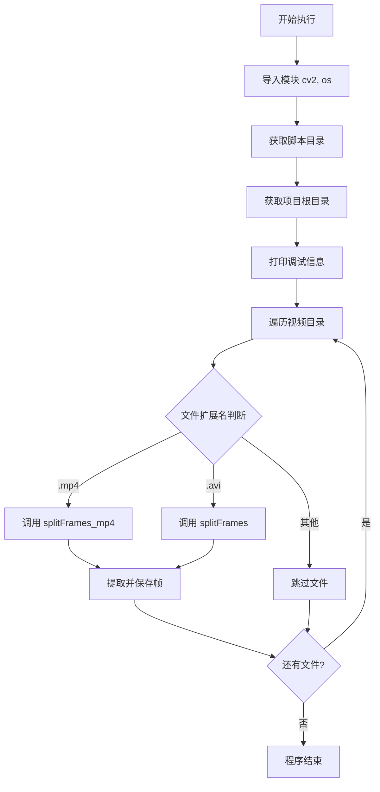
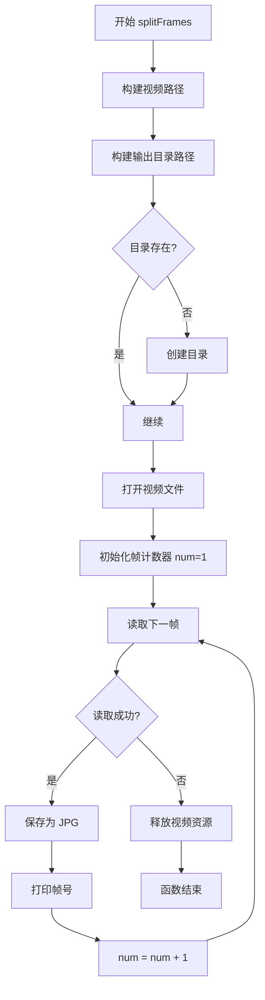
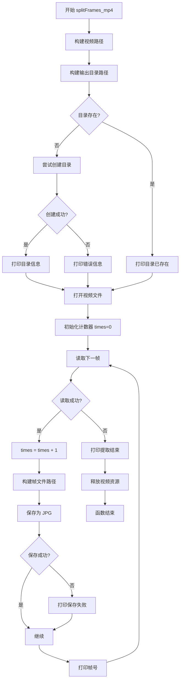
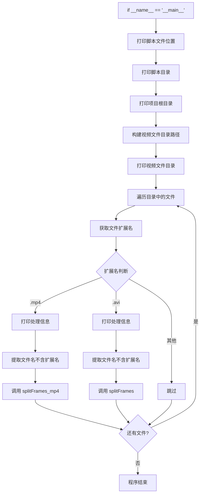
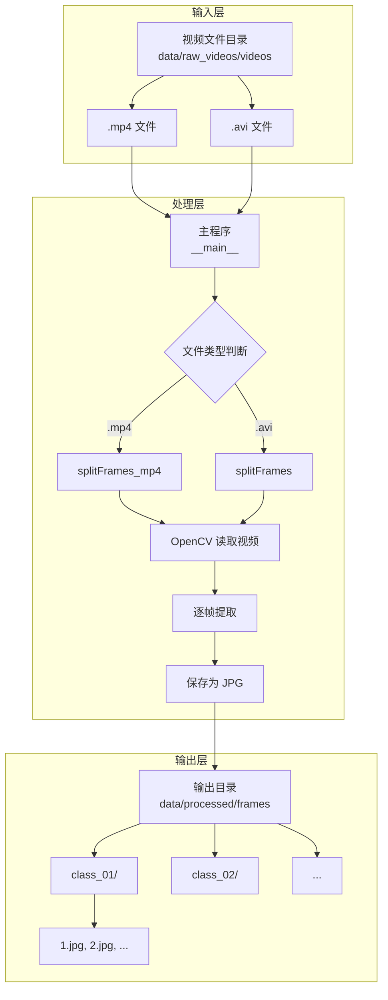
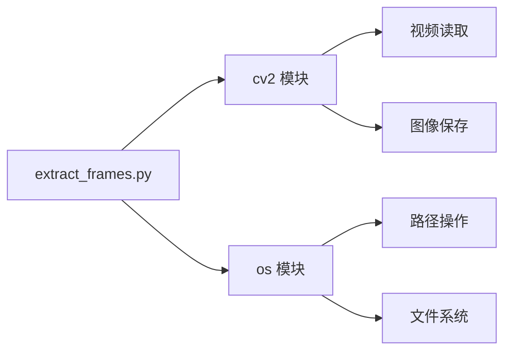
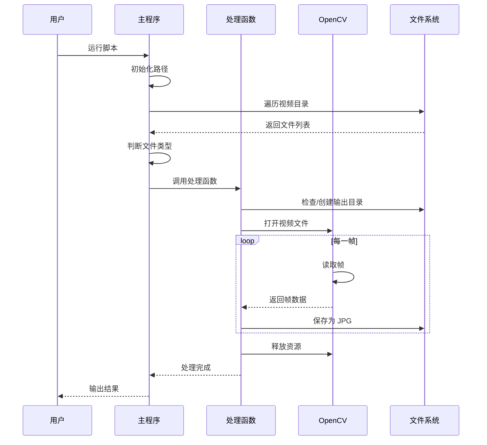
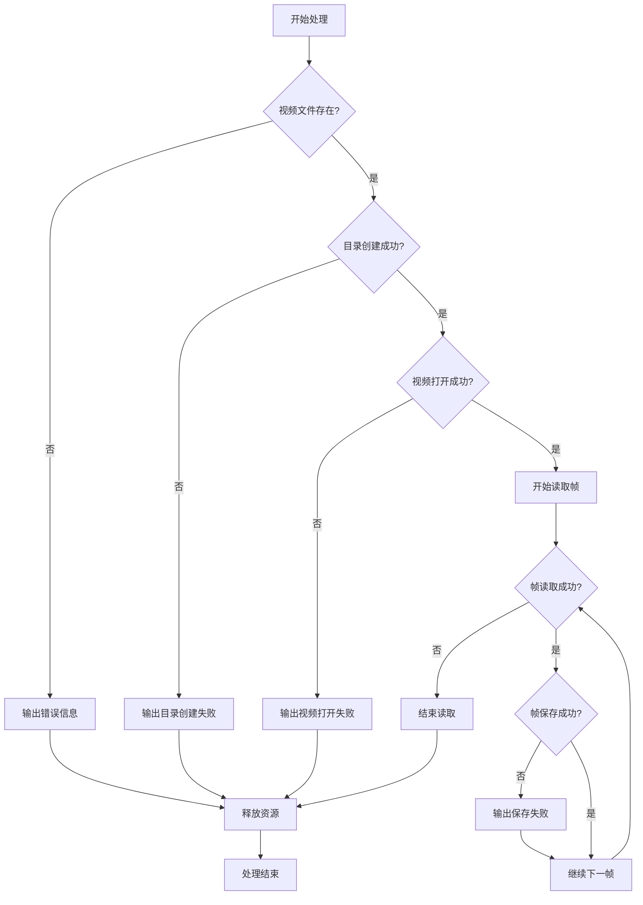
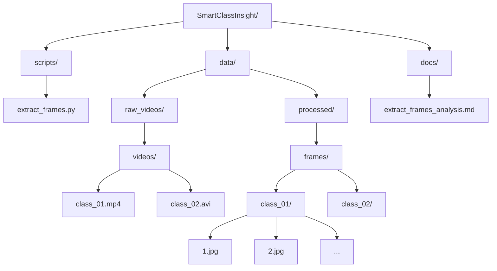

# extract_frames.py 代码分析文档

## 一、功能概述

该脚本是一个视频关键帧提取工具，用于从视频文件中逐帧提取图像并保存为 JPG 格式。支持 `.mp4` 和 `.avi` 两种视频格式。

**主要功能：**
- 批量处理指定目录下的所有视频文件
- 自动识别视频格式（.mp4 或 .avi）
- 逐帧提取并保存为 JPG 图像
- 自动创建输出目录结构

---

## 二、代码结构分析

### 2.1 模块导入
```python
import cv2    # OpenCV 库，用于视频读取和图像处理
import os     # 操作系统接口，用于文件路径操作
```

### 2.2 全局变量
```python
script_dir = os.path.dirname(os.path.abspath(__file__))  # 脚本所在目录
project_root = os.path.dirname(script_dir)               # 项目根目录
```
- 使用 `os.path.abspath()` 获取脚本绝对路径
- 通过 `os.path.dirname()` 向上遍历获取项目根目录
- 确保路径在不同操作系统下都能正确工作

### 2.3 整体架构流程图



---

## 三、核心函数分析

### 3.1 splitFrames() 函数（处理 .avi 视频）

**位置：** [第 10-39 行](file:///d:\Thesis\code\SmartClassInsight\scripts\extract_frames.py#L10-L39)

**功能：** 从 .avi 格式视频中提取所有帧

**参数：**
- `sourceFileName`: 视频文件名（不含扩展名）

**处理流程：**
1. 构建视频输入路径：`data/raw_videos/videos/{filename}.avi`
2. 构建输出目录路径：`data/processed/frames/{filename}/`
3. 检查并创建输出目录
4. 使用 `cv2.VideoCapture()` 打开视频
5. 循环读取每一帧并保存为 JPG
6. 释放视频资源

**特点：**
- 提取所有帧（无采样间隔）
- 简单的进度输出（每帧打印帧号）

**流程图：**


### 3.2 splitFrames_mp4() 函数（处理 .mp4 视频）

**位置：** [第 42-82 行](file:///d:\Thesis\code\SmartClassInsight\scripts\extract_frames.py#L42-L82)

**功能：** 从 .mp4 格式视频中提取所有帧

**参数：**
- `sourceFileName`: 视频文件名（不含扩展名）

**处理流程：**
1. 构建视频输入路径：`data/raw_videos/videos/{filename}.mp4`
2. 构建输出目录路径：`data/processed/frames/{filename}/`
3. 使用 try-except 捕获目录创建异常
4. 使用 `cv2.VideoCapture()` 打开视频
5. 循环读取每一帧并保存为 JPG
6. 检查保存是否成功
7. 释放视频资源

**特点：**
- 更完善的错误处理机制
- 保存失败时输出错误信息
- 进度输出使用制表符分隔（更紧凑）
- 包含注释的采样间隔功能（已禁用）

**流程图：**


---

## 四、主程序分析

**位置：** [第 84-105 行](file:///d:\Thesis\code\SmartClassInsight\scripts\extract_frames.py#L84-L105)

**执行流程：**
1. 打印调试信息（脚本位置、目录结构）
2. 遍历视频目录下的所有文件
3. 根据文件扩展名调用相应的处理函数
4. 自动识别并处理 .mp4 和 .avi 文件

**主程序流程图：**


**数据流图：**


---

## 五、技术特点

### 5.1 优点

1. **跨平台路径处理**
   - 使用 `os.path.join()` 构建路径
   - 自动适应不同操作系统的路径分隔符

2. **绝对路径策略**
   - 使用绝对路径确保文件保存到正确位置
   - 避免相对路径导致的位置混乱

3. **错误处理**
   - `splitFrames_mp4()` 函数包含 try-except 块
   - 保存失败时输出错误信息

4. **自动化处理**
   - 批量处理目录下所有视频
   - 自动创建输出目录

5. **调试友好**
   - 输出详细的路径信息
   - 实时显示处理进度

### 5.2 技术栈

- **OpenCV (cv2)**: 计算机视觉库，用于视频读取和图像保存
- **os**: Python 标准库，用于文件系统操作

---

## 六、潜在问题与改进建议

### 6.1 代码重复问题

**问题：** `splitFrames()` 和 `splitFrames_mp4()` 函数逻辑高度相似，存在大量重复代码。

**建议：** 合并为一个通用函数，通过参数传递视频格式。

```python
def splitFrames(sourceFileName, video_format='mp4'):
    video_path = os.path.join(project_root, 'data', 'raw_videos', 'videos', 
                              f'{sourceFileName}.{video_format}')
    # ... 统一处理逻辑
```

### 6.2 缺少参数验证

**问题：** 未检查视频文件是否存在、是否可读。

**建议：** 添加文件存在性检查和异常处理。

```python
if not os.path.exists(video_path):
    print(f"错误：视频文件不存在: {video_path}")
    return
```

### 6.3 性能问题

**问题：** 
- 提取所有帧可能导致磁盘空间占用过大
- 无采样间隔控制（注释掉的 `frameFrequency` 功能）

**建议：**
- 添加采样间隔参数
- 支持选择性提取关键帧

### 6.4 资源管理

**问题：** 如果程序中途崩溃，视频资源可能未正确释放。

**建议：** 使用上下文管理器或 try-finally 确保资源释放。

```python
try:
    cap = cv2.VideoCapture(video_path)
    # ... 处理逻辑
finally:
    cap.release()
```

### 6.5 日志记录

**问题：** 仅使用 `print` 输出，无日志记录功能。

**建议：** 使用 `logging` 模块替代 `print`，支持日志级别和文件输出。

### 6.6 配置管理

**问题：** 路径硬编码在代码中，灵活性不足。

**建议：** 使用配置文件或命令行参数管理路径配置。

---

## 七、代码质量评估

| 评估维度 | 评分 | 说明 |
|---------|------|------|
| 功能完整性 | ⭐⭐⭐⭐ | 基本功能完整，支持多种格式 |
| 代码可读性 | ⭐⭐⭐⭐ | 命名清晰，有注释 |
| 错误处理 | ⭐⭐⭐ | 部分函数有错误处理，但不全面 |
| 代码复用 | ⭐⭐ | 存在大量重复代码 |
| 性能优化 | ⭐⭐⭐ | 基本性能可接受，但无优化 |
| 可维护性 | ⭐⭐⭐ | 结构清晰，但需要重构 |

---

## 八、使用场景

该脚本适用于：
- 课堂视频分析的前期数据准备
- 视频内容分析的关键帧提取
- 计算机视觉项目的数据预处理
- 视频监控数据的帧提取

---

## 九、总结

该脚本是一个功能完整的视频关键帧提取工具，能够满足基本的使用需求。代码结构清晰，注释充分，易于理解。但存在代码重复、错误处理不完善、配置不灵活等问题，建议进行重构以提高代码质量和可维护性。

**核心改进方向：**
1. 合并重复函数，提高代码复用性
2. 完善错误处理和参数验证
3. 添加配置管理和命令行参数支持
4. 引入日志系统
5. 优化性能，支持采样间隔控制

---

## 十、系统架构图

### 10.1 完整系统流程图



### 10.2 模块依赖关系图



### 10.3 数据流转图



### 10.4 错误处理流程图



### 10.5 目录结构图



